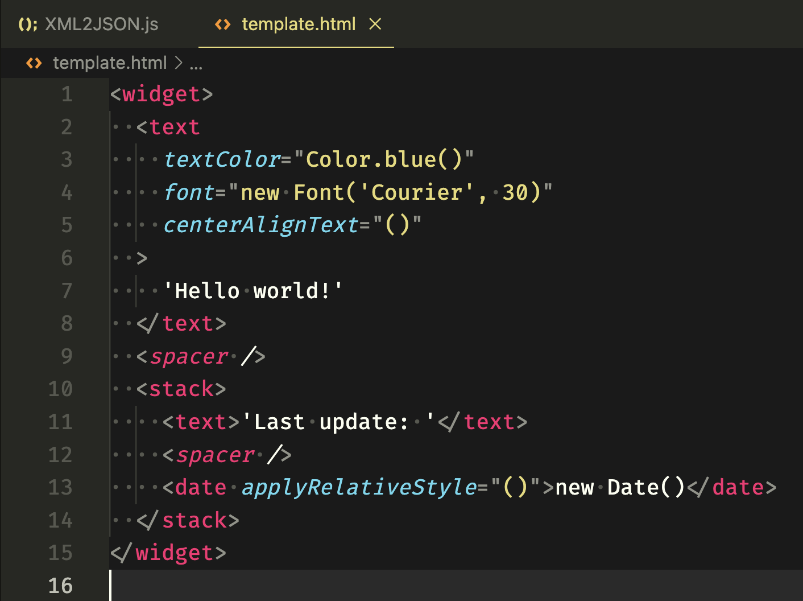
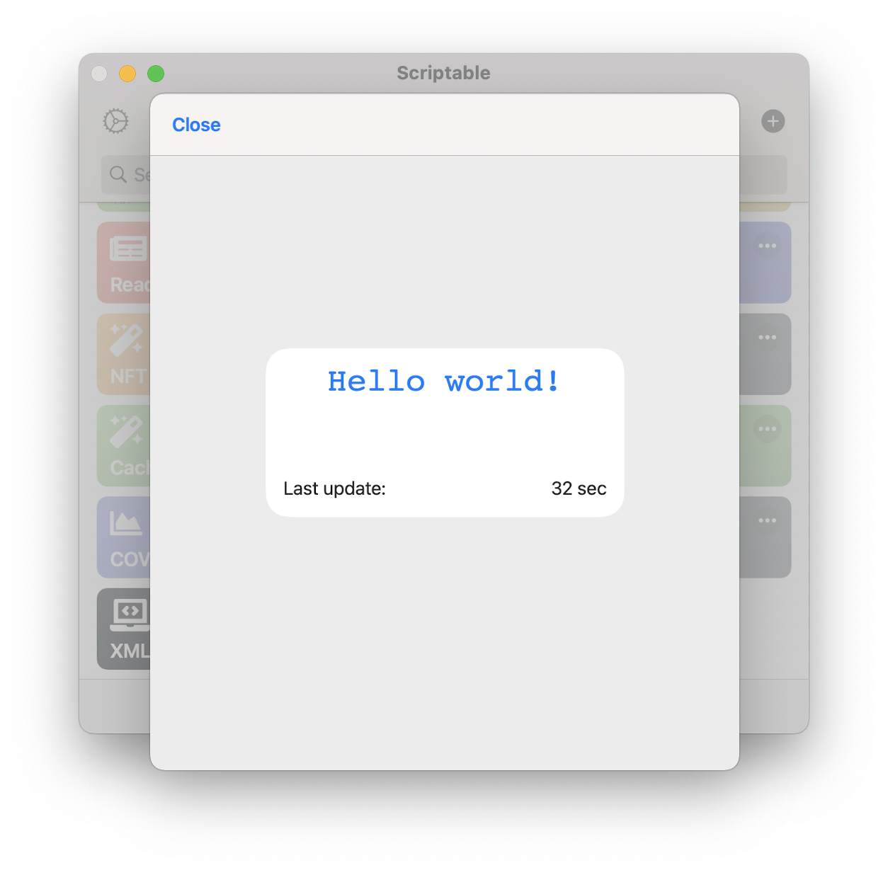

# Scriptable Utils

Utility libraries for Scriptable.

## XML2UI

### Template syntax

All rules almost follow the [Scriptable Docs](https://docs.scriptable.app).

- Element tag name support lowercase or capitalize first letter
- Supports 6 prototype global settings
  - textColor
  - font
  - textOpacity
  - shadowColor
  - shadowRadius
  - shadowOffset

[Examples](examples/)

### Widget

```javascript
const XML2UI = importModule("XML2UI");

const fm = FileManager.iCloud();
const templatePath = fm.joinPath(fm.documentsDirectory(), "template.html");
await fm.downloadFileFromiCloud(templatePath);
const template = fm.readString(templatePath);

const widgetXML = new XML2UI.WidgetXML(template, { debug: true });
const widget = widgetXML.create();

if (config.runsInWidget) {
  Script.setWidget(widget);
} else if (config.runsWithSiri) {
} else {
  await widget.presentMedium();
}

Script.complete();
```





### UI

No implementation yet.
